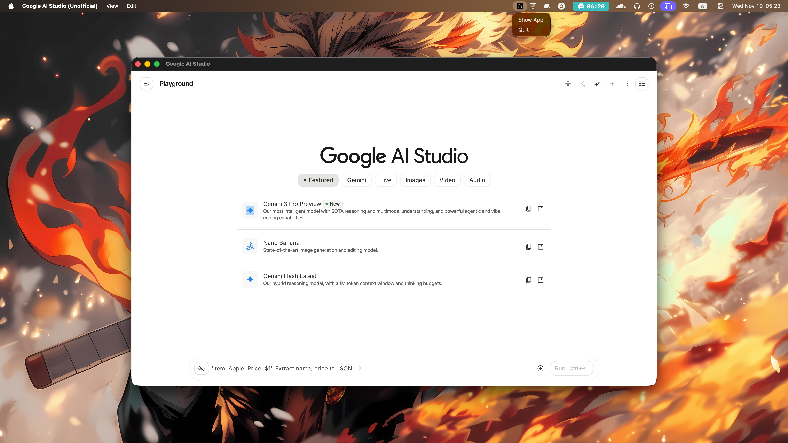

# Google AI Studio & Gemini - Unofficial Desktop Client

A powerful, lightweight desktop wrapper for **Google AI Studio** and **Google Gemini**.

This project allows you to access Google's most powerful AI models in a dedicated window, separate from your browser clutter. It features a **Dual Mode** system, allowing you to switch between the developer-focused _AI Studio_ and the chat-focused _Gemini_ interface instantly.




## 📥 Download

**[Download the latest version for Windows, Mac, and Linux here.](https://github.com/homielab/ai-studio-desktop/releases/latest)**

### ⚠️ Note for Windows Users (Microsoft Edge)

If you download the file and Edge deletes it or says "This file is not commonly downloaded":

1. Hover over the file in the downloads list.
2. Click the **Three Dots (...)** icon or the trash can icon.
3. Select **Keep**.
4. In the popup, click **Show more** ⌵.
5. Click **Keep anyway**.

This warning appears because the app is open-source and not digitally signed with a paid certificate.

---

## 🚀 Features

- **Dual Mode Support:** Switch between **AI Studio** (for prompting/devs) and **Gemini** (for general chat) via the View menu.
- **Dedicated Workspace:** Runs as a standalone app with its own icon, keeping your AI workflow separate from Chrome tabs.
- **Global Hotkey (Toggle):** Press `Cmd+Shift+A` (Mac) or `Ctrl+Shift+A` (Win) to instantly show/hide the window from anywhere.
- **Quick New Chat:** Press `Cmd+Shift+N` (Mac) or `Ctrl+Shift+N` (Win) to jump straight to a new conversation in your current mode.
- **System Tray Support:** Minimizing or closing the window sends it to the system tray, keeping your session alive in the background.
- **Auto-Updates:** The app automatically checks for new versions on startup.
- **Always on Top:** Toggle pin-mode via `Cmd/Ctrl+T` to keep the AI floating over your code editor.

## ⚠️ Important: Installation & Security Warnings

**Please Read:** This application is open-source and free. It is **not code-signed** with a paid certificate (which costs ~$100/year from Apple/Microsoft). Because of this, your operating system will flag it as "Unknown" or "Unsafe."

This is a false alarm common with open-source software. Here is how to install it:

**Windows Users:**

1. When you run the installer, you may see a blue "Windows protected your PC" window.
2. Click **"More Info"**.
3. Click the **"Run Anyway"** button.

**macOS Users:**

1. If you see _"The app is damaged"_ or _"Unidentified Developer"_:
2. **Right-click** the app icon in your Applications folder.
3. Select **Open** from the menu.
4. Click **Open** in the pop-up dialog.
   _(If that doesn't work, open Terminal and run: `xattr -cr /Applications/"Google AI Studio (Unofficial).app"`)_

## ⌨️ Shortcuts

| Feature                  | macOS              | Windows / Linux    |
| :----------------------- | :----------------- | :----------------- |
| **Toggle Window**        | `Ctrl + Shift + A` | `Ctrl + Shift + A` |
| **New Chat**             | `Cmd + Shift + N`  | `Ctrl + Shift + N` |
| **Toggle Always on Top** | `Cmd + T`          | `Ctrl + T`         |
| **Quit App**             | `Cmd + Q`          | `Ctrl + Q`         |
| **Zoom In/Out**          | `Cmd + +/-`        | `Ctrl + +/-`       |
| **Switch Mode**          | Menu -> View       | Menu -> View       |

## 📦 Build from Source

If you prefer to build it yourself rather than downloading the installer:

1.  Ensure you have [Node.js](https://nodejs.org/) installed.
2.  Clone this repository:
    ```bash
    git clone https://github.com/homielab/ai-studio-desktop.git
    cd ai-studio-desktop
    ```
3.  Install dependencies:
    ```bash
    npm install
    ```
4.  Run the app:
    ```bash
    npm start
    ```
5.  Build executable (Output goes to `dist/` folder):
    ```bash
    npm run build
    ```

## 🛠 Technical & Troubleshooting

**"An internal error has occurred" / Login Issues**
Google is very strict about browser fingerprints. This app uses a dynamic User-Agent strategy to match your specific OS (Windows/Mac/Linux).
If you encounter login issues:

1.  **Clear Cache:** Delete the application data folder:
    - **Windows:** `%APPDATA%/Google AI Studio (Unofficial)`
    - **Mac:** `~/Library/Application Support/Google AI Studio (Unofficial)`
2.  Restart the app.

**First Run**
On the first launch, you will be asked to choose your preferred interface (AI Studio or Gemini). You can change this later in the **View** menu.

## ⚠️ Disclaimer

This is an **unofficial** project and is not affiliated with, endorsed by, or connected to Google. "Google AI Studio" and "Gemini" are trademarks of Google LLC. Use this application at your own discretion.

## 📄 License

This project is licensed under the [MIT License](LICENSE).
